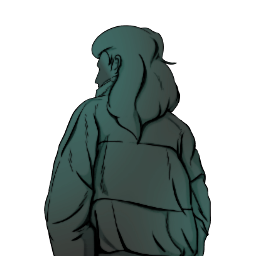

### **Paragon Utility**

“You were on the run till you were picked up by Paragon, Paragon Ex-mole.”

Win Condition: Make all factions have only 50% of their operatives, including Netsec, W3C, and agents. Opsec R requires the current W3C and agent operative to die once.

### **Day:**

Unskilled Attack - Select a node, green or white. Leaves a log.

Hack Target (Very Low) - Select a white node and attempt to hack it. Leaves a log.

Redirection (1 charge) - Select two target operatives, all skills used on the first operative will be used on the second operative, works similar to Throw Under the Bus.

### **Night:**

Plant Agent Documentation (3 charges) - Select a target operative. If the operative is doxxed this round, they will be seen as an agent. If the operative is specialization reviewed, they will be seen as special. If the operative is asked the right question, they will be seen as unable to hack. If the operative is speech analyzed, they will be seen as unable to win with anyone. Visit them.

Move Hideout (1 charge) - Move your hideout, protecting yourself unless you are occupied.

### **Passives:**

Agent Scum - Your true faction is Agent.

Moled - For the Cause will pin you as a mole.