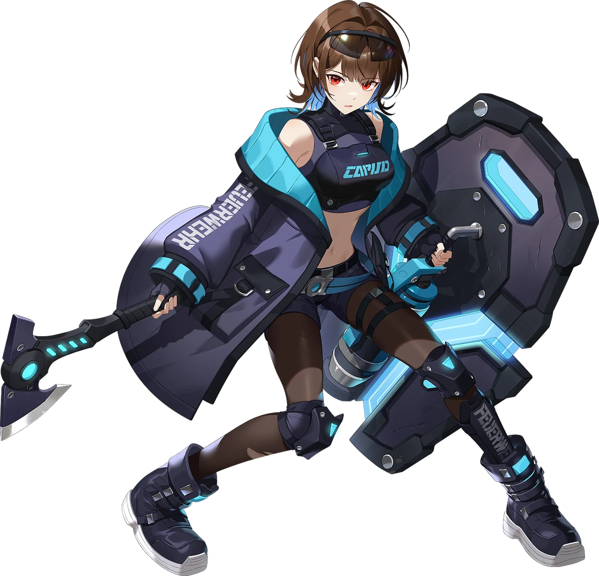

{ width="350" }

### **Paragon Special**

This role is supposed to be unique, depending on the ruleset.

“Time to command Paragon to victory in this Opsec, Paragon Leader.”

Win Condition: Make all factions have only 50% of their operatives, including Netsec, W3C, and agents. 

### **Day:**

Unskilled Attack - Select a node, green or white. Leaves a log.

Hack Target (High) - Select a white node and attempt to hack it. Leaves a log.

Impersonate (1 charge) - Permanently rename your operative to whatever name you want. If you name it the same as another operative, targeting that operative will randomly target either operative of the same name.

 

Computer Forensics Background (Pick 1)

=======================================================================

Denial of Service (2 charges) - Select a green or white node and block all connections to the node this day. Do not leave a log.

Harden Node (D1 -> D3 cooldown, 2 charges) - Select a white node. Decreasing hacking chances of getting this node. Strongest hacking chance nerf. Leaves a log.

Probe Node - Select a white node, increasing hacking chances of getting this node. Strongest hacking chance buff. Leaves a log.

### **Night:**

Cover Your Tracks (2 charges) - Move your hideout, protecting yourself unless you are occupied. Arrest attempts will show a result similar to a target that is immune to arrest, like No Dirt On Me.

Paragon Informant (N1 -> N4 cooldown) - Select a target operative. Choose to visit or not, and reveal their faction and subclass to you. Goes through cover or frames.

Assault and Battery - Select an operative and attempt to murder them. Visit the target.

### **Passives:**

Computer Forensics Background - Pick one of the three abilities between Denial of Service, Harden Node, and Probe Node.

Cover Checks Out - You can pick a Netsec class to frame yourself as until Day 2. Can be arrested after Rent Free is triggered.

Rent Free - Avoid the first arrest attempt and murder attempt on you.