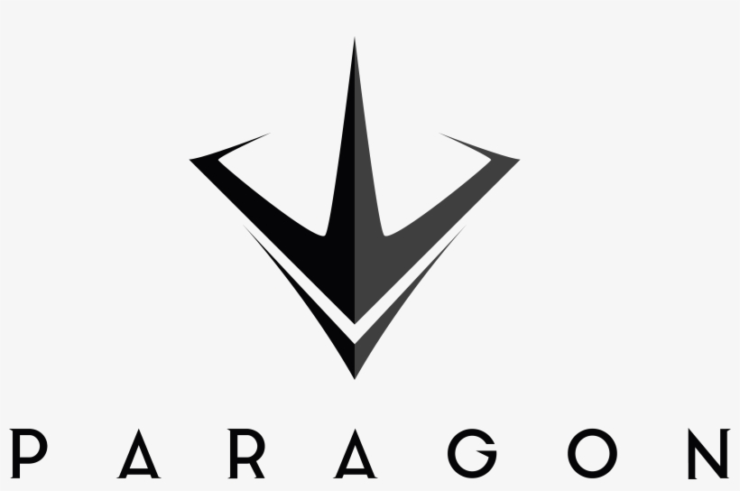

The GREAT Guys

“We’re here to establish a presence and assert dominance on the dark web as the biggest hacking team.”

Win Condition: Make all factions have only 50% of their operatives, including Netsec, W3C, and agents. Opsec R requires the current W3C and agent operative to die once.

Paragon is sorta a neutral faction that needs to kill off half of every faction. Can win with any faction and will lose if all other factions besides one lose before they win. This faction should spawn with SOME kill power, not necessarily a ton, but enough to be able to force a 50% on all other factions. Paragon will be notified if a faction reaches under 50% of their total operatives.