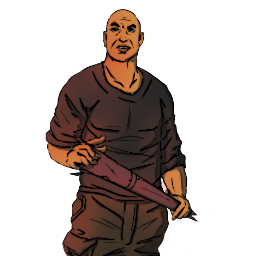

### **W3C Field Operations**

“You were assigned to protect your allies, and you know who they are, W3C Enforcer.”

Win Condition: Prevent the hack from completing on time.

### **Day:**

Unskilled Attack - Select a node, green or white. Leaves a log.

Alter Logs (D1 -> D3 cooldown) - Select a white or green node and either leave a singular fake connection log of one operative, or leave a few random connection logs.

### **Night:**

Fake Escort - Escort a target operative, but leave as soon as trouble comes, letting the original target die or get arrested. Visit and occupy them. Must select a different target the next night.

Interrogate (3 charges) - Select a target operative and occupy them. The host will ask them for their logs, giving you what they send.

Assault and Battery - Select an operative and attempt to murder them. Visit the target.

 

Altar of Heresy (50% W3C operatives left or obtained Root Access)

=======================================================================

Assault and Battery is guaranteed to kill now.

 

Blood for the Blood God (Killed 2 operatives)

=======================================================================

Fake Escort becomes real Escort for W3C operatives and does not occupy W3C operatives.

### **Passives:**

Last Ditch Attempt - If the W3C Leader is arrested, you will be arrested instead of the W3C Leader.

Altar of Heresy - If W3C have only 50% of your operatives left or obtained Root Access, gain these powers.

Blood for the Blood God - If 2 operatives died this Opsec, gain these powers.