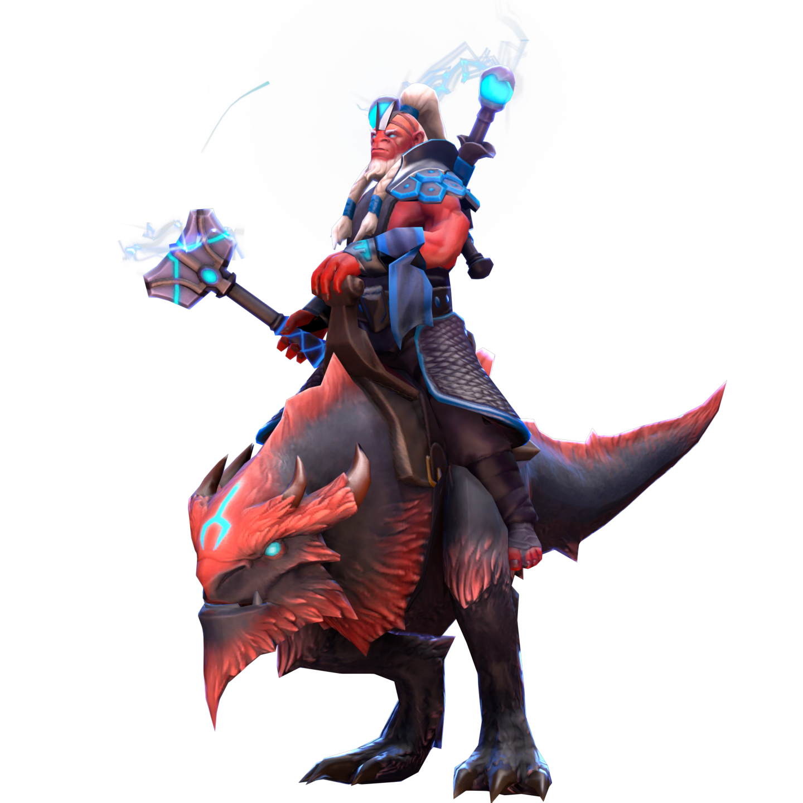

{ width="350" }

### **W3C Offensive**

“You were assigned to disrupt Netsec in their operation, and that’s what you are going to do, W3C Disruptor.”

Win Condition: Eliminate ALL hostile units, or at least 1 hostile unit per day/night phase.

### **Day:**

Hack Target (Moderate) - Select a white node and attempt to hack it. Leaves a log.

Hack ROOT Access - Select a white node. If there is no rooted operative or OL, you can hack into root access by trying to hack a node with the OL’s connection and become a W3C Operation Leader. Leaves a log.

Harden Node (D1 -> D3 cooldown, 2 charges) - Select a white node, decreasing hacking chances of getting this node. Strongest hacking chance nerf. Leaves a log.

 

Blood for the Blood God (Killed 2 operatives)

=======================================================================

Jam Network (2 charges) - Select a target operative and disable all day actions related to the topology done by them.

### **Night:**

Cover Your Tracks (2 charges) - Move your hideout, protecting yourself unless you are occupied. Arrest attempts will show a result similar to a target that is immune to arrest, like No Dirt On Me.

Midnight Meet (N1 -> N3 cooldown) - Select a target operative. Visit and occupy them, talking about the hack. 

Glimpse (N1 -> N3 cooldown) - Select a target operative, any operative targeting action will be done on themselves, but they will not know about it. Visit them.

Disorganized Murder - Select an operative and attempt to murder them. Visit the target.

 

Altar of Heresy (50% W3C operatives left or obtained Root Access)

=======================================================================

Glimpse has no cooldown now.

### **Passives:**

Altar of Heresy - If W3C have only 50% of your operatives left or obtained Root Access, gain these powers.

Blood for the Blood God - If 2 operatives died this Opsec, gain these powers.