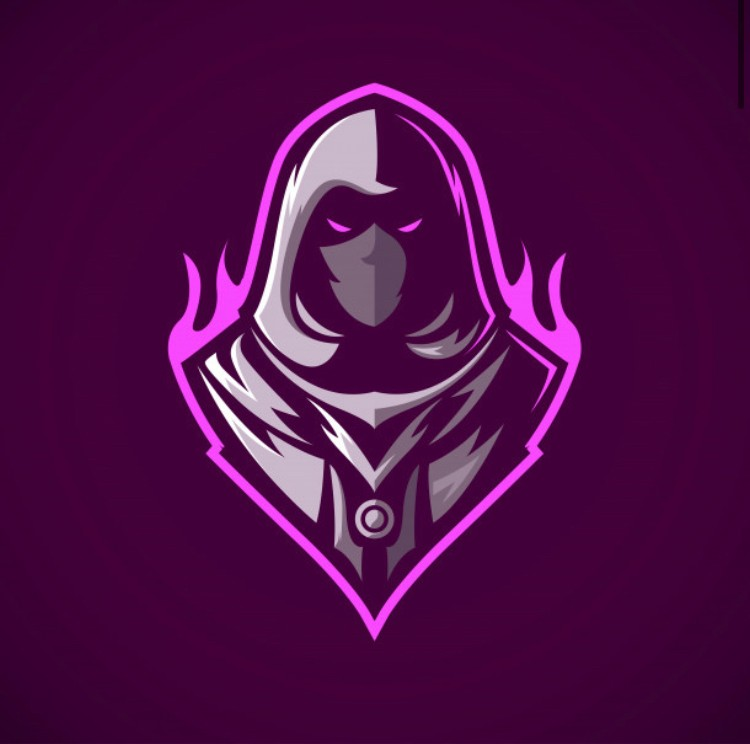

{ width="350" }

### **W3C Social**

“A hired assassin is always useful for W3C’s sadistic needs, W3C Assassin.”

Win Condition: Eliminate ALL hostile units (Netsec, Agent, and Neutral Killing). Opsec R requires you to acquire and hold root for N day/night cycles.

### **Day:**

Hack Target (Low) - Select a white node and attempt to hack it. Leaves a log.

Sacrificial Shot - Select a target operative and guess their role. If you guess right, attempt to shoot the target operative tonight. If you guess wrong, take your own life instead. Removes all frames and covers. You will know if you guessed right or wrong.

Prepare Murder (1 charge) - Gives you one charge of murder.

 

Altar of Heresy (50% W3C operatives left or obtained Root Access)

=======================================================================

Prepare Murder has 2 more charges now.

### **Night:**

Sacrificial Shot - Select a target operative and guess their role. If you guess right, attempt to shoot the target operative. If you guess wrong, take your own life instead. Removes all frames and covers.

Follow (2 charges) - Select a target operative and follow them, visiting them and checking if they left their hideout and met anyone. If they were occupied, you’d only know that they could not leave their hideout.

Misdirection (1 charge) - Occupy anyone that visits you directly, blocking any attempts to visit, occupy, and kill directly. Does not save you from Raids, Stings, and other indirect methods of killing this operative.

Murder (0 charges) - Select an operative and murder them. Cannot be dodged in any way. Occupies and visits the target.

 

Blood for the Blood God (Killed 3 operatives manually)

=======================================================================

Investigation (N1 -> N3 cooldown) - Select a target operative. Learn between three subclasses. One is the real subclass, which pierces any cover and frame. Visit them.

### **Passives:**

Altar of Heresy - If W3C have only 50% of your operatives left or obtained Root Access, gain these powers.

Blood for the Blood God - If W3C has directly killed 3 operatives this Opsec, gain these powers.