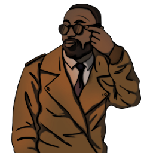

### **W3C Utility**

“You’ve tricked the client into letting you inside, but how much of that will you use for W3C, W3C Insider.”

Win Condition: Eliminate ALL hostile units, or at least 1 hostile unit per day/night phase.

### **Day:**

Unskilled Attack - Select a node, green or white. Leaves a log.

Insider Knowledge (D1 -> D3 cooldown, 2 charges) - Tells you the IP of a node with downloadable intel on it.

### **Night:**

Replace Laptop (N1 -> N3 cooldown, 2 charges) - Replace a selected laptop with a server by connecting a company server to future nodes and disconnecting the laptop.

Replace Server (N1 -> N3 cooldown, 2 charges) - Replace a selected server with a laptop by connecting a company laptop to future nodes and disconnecting the server.

Hostage Operative (N1 -> N3 cooldown) - Select a target operative and hold them hostage tonight. Choose a night ability the next day to use from the operative’s role for the next phases. Occupy and visit them.

Scout Dead Operative (2 charges) - Select a murdered or arrested operative. Choose an ability from the operative to use from the operative’s role, and use it this phase. Do not visit them.

 

Altar of Heresy (50% W3C operatives left or obtained Root Access)

=======================================================================

Hostage Operative has no cooldown now.

 

Blood for the Blood God (Killed 2 operatives)

=======================================================================

Scout Dead Operative has infinite charges now.

### **Passives:**

Altar of Heresy - If W3C have only 50% of your operatives left or obtained Root Access, gain these powers.

Blood for the Blood God - If 2 operatives died this Opsec, gain these powers.

Target Knowledge - You can see which node is the final target.